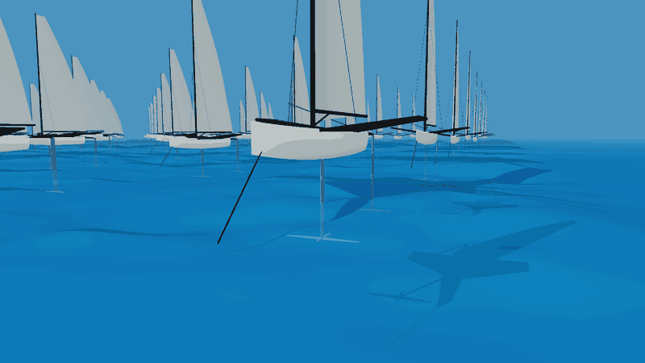
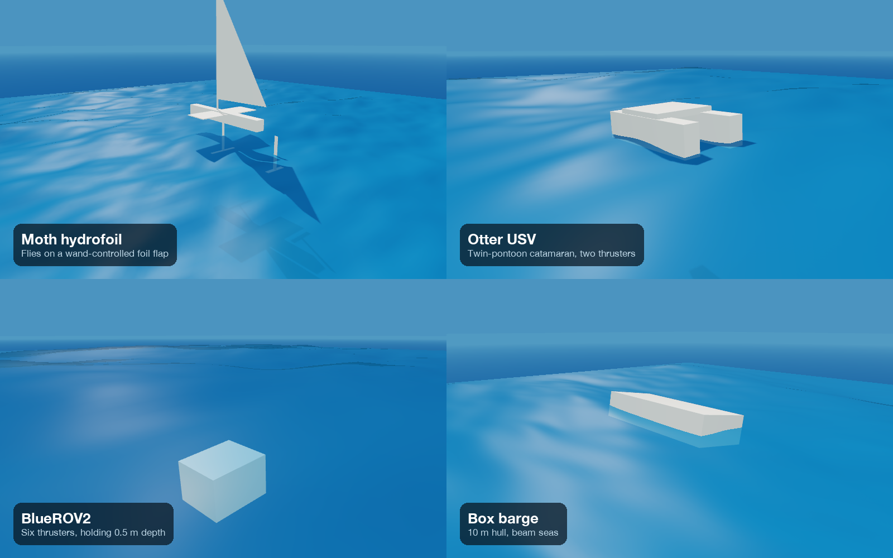
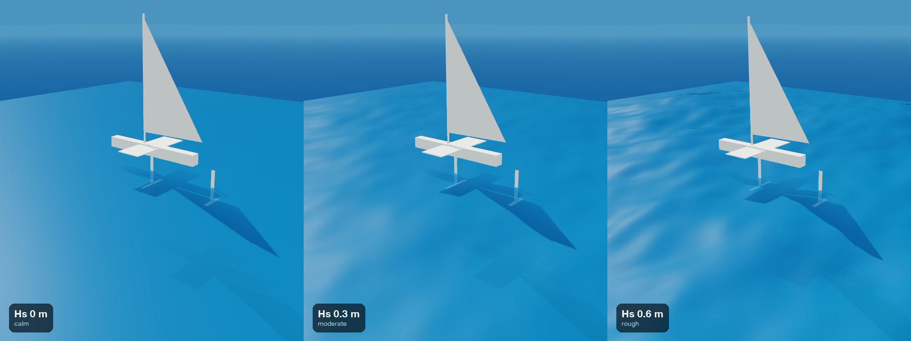
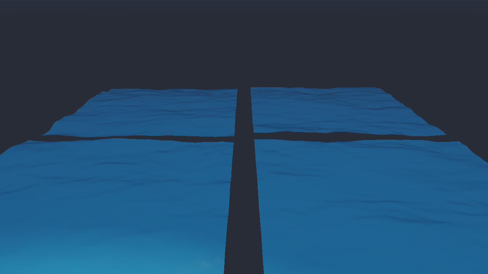
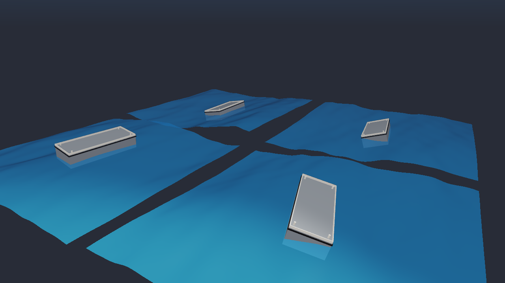
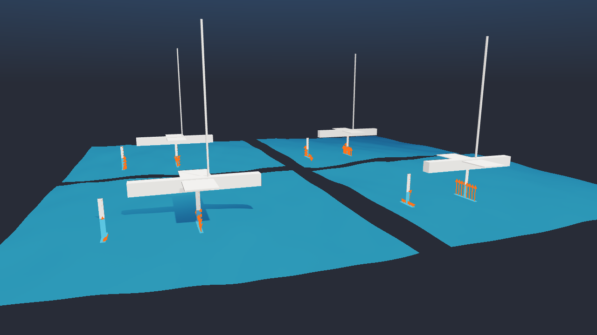
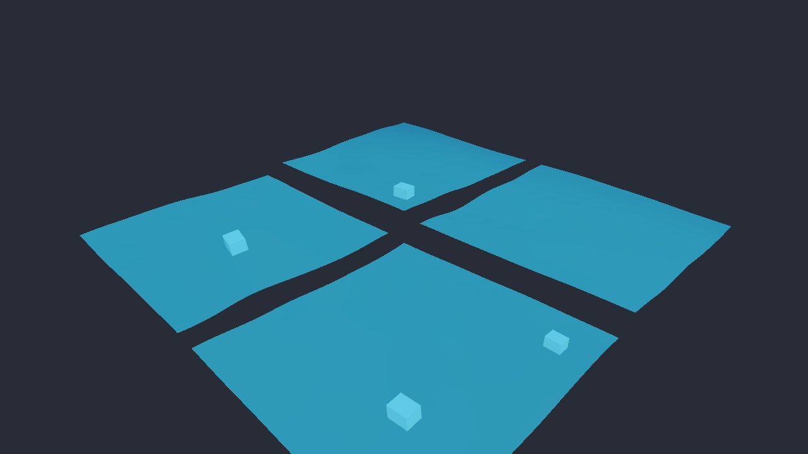

# WaterGym

[](https://github.com/mariusud/watergym/actions/workflows/ci.yml)
[](pyproject.toml)
[](LICENSE)

A batched PyTorch gym for vessels in waves: hydrofoils, boats, USVs and underwater vehicles, on CPU, Apple MPS or CUDA.

<p align="center">
  
</p>

## Quickstart

```bash
git clone https://github.com/mariusud/watergym && cd watergym
uv run --extra viz examples/03_moth_on_foils.py
```

`uv run` installs everything on first use, then opens a window with four Moths flying into 0.3 m waves. No display? Add `--headless --screenshot out.png`, or `--viewer null` to run the physics without drawing. Without the `viz` extra, `uv sync` installs only numpy and torch.

[Try it in Colab](https://colab.research.google.com/github/mariusud/watergym/blob/main/notebooks/quickstart.ipynb) with no install. The notebook is [notebooks/quickstart.ipynb](notebooks/quickstart.ipynb).

## Using it

```python
import math

import torch

from watergym import SeaState, WaterEnv
from watergym.vessels import moth
from watergym.vessels.moth_vessel import wand_action


def ride_height(env: WaterEnv) -> torch.Tensor:
    """1 at the starting ride height, 0.37 at 10 cm off. NED z points down."""
    error = env.eta[:, 2] - env.vessel.initial_eta[2]
    return torch.exp(-((error / 0.1) ** 2))


head_seas = SeaState(hs=0.3, tp=3.0, heading_rad=math.pi)  # 0.3 m waves on the bow
env = WaterEnv(moth(), num_envs=64, sea_state=head_seas, reward_fn=ride_height)
obs, info = env.reset(seed=0)

for _ in range(250):  # 5 s at dt = 0.02 s
    action = wand_action(env.sea, env.t, env.eta)  # [64, 2]: sail, flap. Your policy goes here.
    obs, reward, terminated, truncated, info = env.step(action)

print(obs.shape, f"mean reward {reward.mean():.2f}")
```

```
torch.Size([64, 12]) mean reward 0.61
```

Every tensor is shaped `[num_envs, ...]`. `obs` is `[eta, nu]`, the NED pose and body velocity, and each env draws its own sea. Envs that capsize or time out reset inside `step()`, and their last observation is in `info["final_obs"]`. `wand_action` is the Moth's mechanical ride-height controller, standing in for a policy here.

A vessel is a dataclass: a `RigidBody` (mass, inertia, added mass, damping), hull volume samples for buoyancy, a mesh for drawing, and optional `Foil`s and `Thruster`s. The four in `watergym/vessels/` are written out in full, so copy one to start a new vessel.

## Why it exists

Legged robots have legged_gym and rsl_rl: thousands of robots stepped in parallel, a task with a reward, and PPO on top. Vessels in waves have no equivalent. [MarineGym](https://github.com/Marine-RL/MarineGym) ([arXiv:2503.09203](https://arxiv.org/abs/2503.09203)) batches underwater vehicles on the GPU but has no free surface. [VRX](https://github.com/osrf/vrx) and [Stonefish](https://github.com/patrykcieslak/stonefish) model waves but are built around one CPU simulation at a time.

WaterGym is a start on that missing piece. Each vessel gets its own irregular sea, the physics is plain PyTorch tensors, the API follows Gymnasium's vector envs, and an adapter plugs it into rsl_rl. On 2 CPU threads of an Apple M4 Pro, 1024 Moths step at about 8,000 env-steps per second, 166 times real time.

It is for RL researchers who want a disturbance-rejection benchmark beyond terrain, and for marine control engineers who want to test learned controllers against PID and the wand on the same seas. It is young: version 0.1, one benchmark task, and the simplifications listed below.

## Vessels

<p align="center">
  
</p>

| Vessel | Function | Actions | Where the numbers come from |
|---|---|---|---|
| 10 x 4 x 2 m box barge | `box_barge()` | none | analytic hydrostatics (Newman, *Marine Hydrodynamics*), the reference case |
| Otter USV, 2 m catamaran | `otter()` | 2 thrusters | Fossen's [PythonVehicleSimulator](https://github.com/cybergalactic/PythonVehicleSimulator) |
| International Moth | `moth()` | sail, main-foil flap | Moth class rules and Day et al. 2019 T-foil tank tests; sailor mass and wand geometry are estimates |
| BlueROV2 Heavy | `bluerov2()` | 8 thrusters | von Benzon et al. 2022, *JMSE* 10:1898, Table A1 |

All four import from `watergym.vessels`, one file each in `src/watergym/vessels/`.

## Sea state is the benchmark axis

<p align="center">
  
</p>

Legged RL got harder when terrain did. Here the knob is the sea: every task runs over a grid of significant wave height Hs, peak period Tp and heading, and a score is a set of curves against sea state, never a single number.

The first task is **RideControl-Moth-v0**. A policy moves the main-foil flap to hold the hull 0.6 m above the mean water level, seeing only what a real foiler can measure: bow height, pitch, pitch rate, heave acceleration, speed and its last command. The quick sweep runs in about 30 s on a laptop CPU:

```bash
OMP_NUM_THREADS=2 uv run --with matplotlib python benchmarks/ride_control_sweep.py --quick
```

Baselines from that sweep, head seas, Tp 3 s:

| Hs [m] | wand tracking RMS [m] | wand a_w [m/s²] | zero-flap tracking RMS [m] | zero-flap crashes / min |
|---|---|---|---|---|
| 0.0 | 0.069 | 0.04 | 0.27 | 18 |
| 0.2 | 0.073 | 0.52 | 0.26 | 15 |
| 0.4 | 0.084 | 1.07 | 0.25 | 12 |
| 0.6 | 0.103 | 1.70 | 0.21 | 12 |

The wand never crashes, but it follows the waves, so the ISO 2631 comfort figure a_w climbs past 1 m/s² by Hs 0.4 m. A controller that flies level through the crests should beat it there. Pass your own policy as `--policy wand mypkg.policies:actor`. The task is frozen: any change to its reward, observations or seeds makes a new id. Observations, reward, metrics and the full grid are in [docs/benchmark.md](docs/benchmark.md).

## Training

Train a policy with [rsl_rl](https://github.com/leggedrobotics/rsl_rl)'s PPO, then watch it:

```bash
uv run --extra rl examples/train_rsl_rl.py --num-envs 1024 --iterations 300
uv run --extra rl --extra viz examples/train_rsl_rl.py --play logs/rsl_rl/moth/<run>/model_299.pt
```

The example trains the Moth to hold its starting ride height and writes checkpoints and TensorBoard logs to `logs/rsl_rl/moth/`. Add `--device mps` or `--device cuda` for more envs. `RslRlVecEnv(env)` wraps any `WaterEnv`; how terminations map to rsl_rl's time-outs is in [docs/training.md](docs/training.md).

## Examples and the viewer

| | |
|---|---|
|  `01_sea_state.py`: four JONSWAP seas with Hs 1.5 m and Tp 4.5 s, each with its own random phases |  `02_floating_box.py`: 10 m box barges heaving and rolling in beam seas |
|  `03_moth_on_foils.py`: International Moths foiling through head seas, flap set by the mechanical wand, lift and drag arrows per foil strip |  `04_underwater_vehicle.py`: BlueROV2s holding 0.5, 1, 2 and 4 m depth under waves |

Each example is one script you read top to bottom. Drawing uses [Newton](https://github.com/newton-physics/newton)'s viewer from the `viz` extra: one grid cell per env, the sea patch follows its vessel, and orange arrows show the force on every foil strip. `--viewer gl` opens a window, `viser` serves a browser view, `usd` records a file and `null` draws nothing. Every example also takes `--headless --screenshot out.png`, and `--device mps` or `--device cuda` where it has a `--device` flag.

## Learning path

**Tutorials.** Five short hands-on pages in [docs/tutorials](docs/tutorials/README.md), each building on the last:

1. [First sea](docs/tutorials/01-first-sea.md): make a sea, sample the surface, draw it.
2. [Make it float](docs/tutorials/02-make-it-float.md): drop a barge and check its draft against Archimedes.
3. [Foiling Moth](docs/tutorials/03-foiling-moth.md): fly with the wand, read the foil loads, then break the wand.
4. [Your own vessel](docs/tutorials/04-your-own-vessel.md): define a box ROV from scratch.
5. [Batching and devices](docs/tutorials/05-batching-and-devices.md): `num_envs`, seeds, CPU, MPS and CUDA.

**Concepts.** Frames, waves, rigid-body equations, buoyancy, foils and batching, in [docs/concepts](docs/concepts/README.md). Each page starts with an example you can check by hand. No marine background is assumed.

## How it fits together

<p align="center">
  
</p>

```
src/watergym/
  waves.py          JONSWAP spectrum, directional seas, surface elevation, orbital velocity and acceleration
  rigid_body.py     Fossen 6-DOF equations: kinematics, Coriolis, damping, RK4
  geometry.py       boxes as volume samples (buoyancy) and as meshes (drawing)
  hydrostatics.py   buoyancy plus Froude-Krylov force from samples against the instantaneous surface
  foils.py          strip-theory lift and drag, free-surface lift loss, ventilation with hysteresis
  vessel.py         Vessel and Thruster, and the sum of forces that drives the equations of motion
  vessels/          box_barge, moth, otter, bluerov2
  env.py            WaterEnv: batched reset/step in the Gymnasium vector style
  tasks/            versioned benchmark tasks and metrics, starting with RideControl-Moth-v0
  viewer.py         draws seas, vessels and force arrows with Newton's viewer
  rl/               rsl_rl adapter (extra: rl)
examples/           numbered scripts, each runs on its own
benchmarks/         the sea-state sweep and its results
notebooks/          Colab quickstart
docs/               tutorials, concepts, training, benchmark
tests/              physics checks, one file per module
```

## Physics in one paragraph

Fossen's equation (M_RB + M_A) nu_dot + C(nu) nu + D(nu) nu = tau, integrated with RK4, with eta and nu in NED as in Fossen's handbook. The sea is a sum of Airy components drawn from a JONSWAP spectrum. Each submerged volume sample feels rho V (a_water - g), which gives buoyancy, restoring moments and Froude-Krylov wave forces in one term. Foils are cut into spanwise strips that see the water velocity relative to the strip, waves included. The [concepts](docs/concepts/README.md) pages explain every term for readers new to marine hydrodynamics.

## What the tests check

- Hs from the generated components and from a 30 min surface record; Airy orbital velocity; surface rise rate equals vertical orbital velocity.
- Free fall, RK4 fourth-order convergence, Coriolis forces doing no work.
- Box barge: floats at the analytic draft, heave stiffness rho g L B, roll moment from GM, heave natural period within 1 %, follows long waves.
- Foils: 2 pi alpha in deep water, Helmbold slope, the free-surface table, lift falling toward the surface, ventilation hysteresis.
- The ISO 2631 Wk weighting against the standard's table, and the v0 task definition staying frozen.
- Env API shapes, seeding, auto-reset, and the wand keeping a Moth flying.

Reference values come from DNV-RP-C205 (JONSWAP), linear wave theory as in Faltinsen's *Sea Loads on Ships and Offshore Structures*, textbook box hydrostatics (Newman, *Marine Hydrodynamics*), thin-airfoil and Helmbold lift (Abbott and von Doenhoff) and ISO 2631-1:1997. Run them with `uv run pytest`.

## Simplifications to know about

- Euler angles, singular at 90 degrees pitch. Vessels never get there.
- Constant added mass and linear plus quadratic damping per vessel. No radiation memory, diffraction or second-order drift yet.
- Deep-water waves only. Above the mean surface the orbital velocity is held at its mean-level value.
- Damping acts on the body velocity, not the velocity relative to the waves.
- Hulls are boxes cut into vertical cells. Fewer cells across the beam lowers the waterplane inertia and with it GM, so the barge uses 16.
- The Moth flies in the vertical plane only (surge, heave, pitch): the sailor's roll balance is not modelled, the sail is a constant forward force at the CG, and the wand reads the water height under its pivot.
- Foils use thin-airfoil lift with a stall clamp and a flap-effectiveness factor, not a measured polar. Ventilation thresholds are placeholders; the hysteresis is real, the numbers are not.
- The BlueROV2 has four horizontal and four vertical thrusters in a simplified layout.
- No actuator lag, sensor noise or wind yet, so no policy trained here has been tested on a real vessel.
- Ventilation washout depends only on angle of attack, and struts use the horizontal-foil free-surface factor. Both are rough, and each will change together with a test that pins the new behavior.

## Roadmap

The next goal is one policy, trained in WaterGym, controlling a real vessel in real waves, with logs and a protocol others can repeat. In order:

1. Actuator lag, rate limits and per-episode latency randomization, then IMU, compass and GNSS noise models.
2. An ArduPilot SITL bridge, so WaterGym can be the physics behind the autopilot that BlueBoat and BlueROV2 already run.
3. System identification from logged runs, writing a model card per vessel.
4. A BlueBoat trial across a sea-state ladder from calm to Hs 0.3 m, against tuned ArduRover, PID and PPO. An RC-scale foiler is the stretch goal.

More tasks follow the same sea-state grid: StationKeep and PathFollow for USVs, DepthHold under waves for the BlueROV2, and roll damping with active fins. On the physics side: radiation memory, diffraction and drift forces, mesh hulls in place of boxes, and a mesh to hydrodynamic-coefficients compiler.

## Borrowed from

- [legged_gym](https://github.com/leggedrobotics/legged_gym) and [rsl_rl](https://github.com/leggedrobotics/rsl_rl): the pattern of a batched env, a task with a reward and PPO on top, and the idea of a graded disturbance as the difficulty axis.
- [mjlab](https://github.com/mujocolab/mjlab): `src/` layout, uv for everything, a README that leads with commands you can run.
- [MuJoCo Playground](https://github.com/google-deepmind/mujoco_playground): one file per model, grouped in one folder, and a picture per example.
- [CleanRL](https://github.com/vwxyzjn/cleanrl): examples are single scripts you read top to bottom, with argparse flags and no framework.
- [Gymnasium](https://github.com/Farama-Foundation/Gymnasium): `reset(seed) -> (obs, info)`, the five-value `step`, vector-env style, and versioned task ids.
- [PythonVehicleSimulator](https://github.com/cybergalactic/PythonVehicleSimulator): NED frames, `eta`/`nu` notation, `Rzyx`, `Tzyx` and `m2c`, and the Otter coefficients.

## How to cite

Not yet published. Placeholder:

```bibtex
@software{watergym,
  title = {WaterGym: a batched PyTorch gym for vessels in waves},
  author = {TODO},
  year = {2026},
  url = {https://github.com/mariusud/watergym}
}
```

## License

MIT, see [LICENSE](LICENSE).
