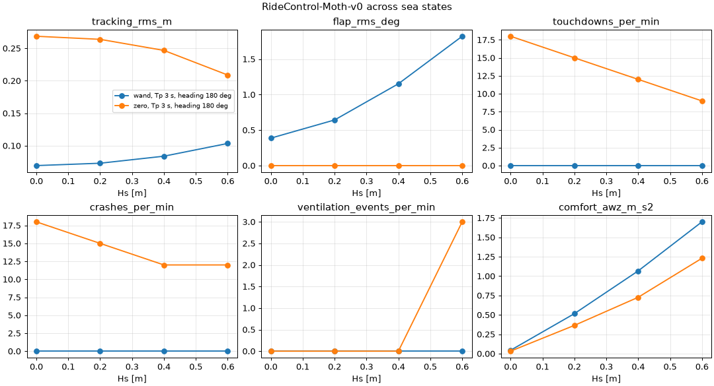

# Benchmark: RideControl-Moth-v0

An International Moth flies into waves and a controller moves the main-foil flap to hold the hull 0.6 m above the mean water level. The score is a set of curves against sea state, never a single number: the sweep runs the same policy at every point of an (Hs, Tp, heading) grid on fixed evaluation seeds.

## Evaluate a policy

A policy is any callable from observations `[num_envs, 6]` to a flap command `[num_envs, 1]` in `[-1, 1]`.

```python
import torch

from watergym.tasks import make
from watergym.tasks.metrics import summarize
from watergym.tasks.ride_control import DT, EVAL_SEEDS, sea_state, wand_policy

task = make("RideControl-Moth-v0", num_envs=4, sea=sea_state(hs=0.4, tp=3.0))
obs, info = task.reset(seed=EVAL_SEEDS[0])
signals = []
for _ in range(500):  # 10 s
    obs, reward, terminated, truncated, info = task.step(wand_policy(obs))
    signals.append(info["signals"])

print(summarize({k: torch.stack([s[k] for s in signals]) for k in signals[0]}, DT))
```

The sweep runs that loop over the grid and writes a CSV and a plot:

```sh
OMP_NUM_THREADS=2 uv run --with matplotlib python benchmarks/ride_control_sweep.py --quick
uv run --with matplotlib python benchmarks/ride_control_sweep.py --policy wand mypkg.policies:actor
```

`--quick` runs 4 wave heights in head seas, 4 envs, 10 s, one seed, in about 30 s on a laptop CPU. The full grid is Hs 0 to 0.6 m in 0.15 m steps, Tp 2.5 and 4 s, head and following seas, 16 envs, 60 s and all three evaluation seeds. Train on any seed outside `EVAL_SEEDS`.

## The task

`step` takes the flap only. The sail stays at 0.65 of its 200 N, so the policy cannot trade speed for height.

Observations are what a real foiler can measure:

| index | name | sensor |
|---|---|---|
| 0 | `bow_height_m` | ultrasonic or wand: the bow sensor, 1.5 m forward, to the water directly below it |
| 1 | `pitch_rad` | IMU attitude |
| 2 | `pitch_rate_rad_s` | gyro |
| 3 | `heave_accel_m_s2` | accelerometer, up positive, gravity removed |
| 4 | `speed_m_s` | GPS or log |
| 5 | `last_flap` | the previous command |

The bow sensor reads the instantaneous surface, wave crests included, so it sees the same thing the wand does. `wand_policy(obs)` is the mechanical wand applied to observation 0, and it matches `wand_action` exactly.

`info["privileged_obs"]` adds ten values for an asymmetric critic: the true ride height, clearance above the local surface, heave rate, main foil depth, which lifting foils are ventilated, and the sea state (Hs, Tp, cos and sin of the heading).

The reward, in `ride_control_reward`:

```
  1.0  * exp(-(height error / 0.1 m)^2)
+ 0.5  * exp(-(pitch / 2 deg)^2)
- 0.05 * flap^2
- 0.5  * (flap - last flap)^2
- 0.01 * heave accel^2
- 20   * crashed
```

The tracking terms are bounded in [0, 1], so every airborne step scores above a crashed one.

An episode ends on a crash or after 20 s. A crash is any of:

- touchdown: any part of the hull bottom below the local water surface,
- ventilation crash: the main foil ventilates, losing 75 % of its lift,
- excessive tilt: pitch beyond 15 degrees.

## Metrics

| metric | meaning |
|---|---|
| `tracking_rms_m` | RMS of ride height minus 0.6 m, over every step |
| `flap_rms_deg` | RMS flap angle, the control effort |
| `touchdowns_per_min` | hull touchdowns per minute sailed |
| `crashes_per_min` | all crashes per minute sailed |
| `ventilation_events_per_min` | times a lifting foil starts to ventilate, per minute |
| `comfort_awz_m_s2` | ISO 2631-1 frequency-weighted vertical acceleration a_w |

Every count is divided by total sailed time, envs times seconds, so a policy that crashes often is not rewarded with shorter episodes.

`comfort_awz_m_s2` follows ISO 2631-1:1997, *Mechanical vibration and shock: evaluation of human exposure to whole-body vibration*. The standard's own comfort guide (Annex C) reads a_w below 0.315 m/s² as not uncomfortable and 0.8 to 1.6 m/s² as uncomfortable.

The heave acceleration at the CG goes through the Wk weighting of Annex A: band limits at 0.4 and 100 Hz, an acceleration-velocity transition at 12.5 Hz and an upward step between 2.37 and 3.35 Hz. `metrics.py` builds it from the four analog filters, turns each into a biquad with the bilinear transform and runs them in series. The analog weighting matches the standard's table to 1 % from 0.1 to 31.5 Hz, and the 50 Hz digital filter matches it to 3 % from 0.5 to 8 Hz (`tests/test_tasks.py`).

## Baselines



From `--quick`: head seas, Tp 3 s.

| Hs [m] | wand tracking RMS [m] | wand flap RMS [deg] | wand a_w [m/s²] | zero-flap tracking RMS [m] | zero-flap crashes / min | zero-flap a_w [m/s²] |
|---|---|---|---|---|---|---|
| 0.0 | 0.069 | 0.39 | 0.04 | 0.27 | 18 | 0.03 |
| 0.2 | 0.073 | 0.64 | 0.52 | 0.26 | 15 | 0.36 |
| 0.4 | 0.084 | 1.15 | 1.07 | 0.25 | 12 | 0.73 |
| 0.6 | 0.103 | 1.82 | 1.70 | 0.21 | 12 | 1.23 |

The wand never crashes on this grid. It holds the Moth about 0.07 m low in flat water, which is its whole tracking error there, and it follows the waves: the flap works harder and a_w climbs past 1 m/s² by Hs 0.4 m. That leaves room on comfort for a controller that flies level through the crests. With the flap at zero the Moth sinks onto its hull 12 to 18 times a minute. At Hs 0.6 m three of its crashes per minute are main-foil ventilation as the sinking foil nears the surface.

## Versioning

`RideControl-Moth-v0` is frozen: the constants, reward, observations, terminations and evaluation seeds in `watergym/tasks/ride_control.py`, pinned by `test_v0_definition_is_frozen`. Any change to them is a new id, `RideControl-Moth-v1`. Physics changes in the simulator also move the numbers, so report the WaterGym version beside every score.
